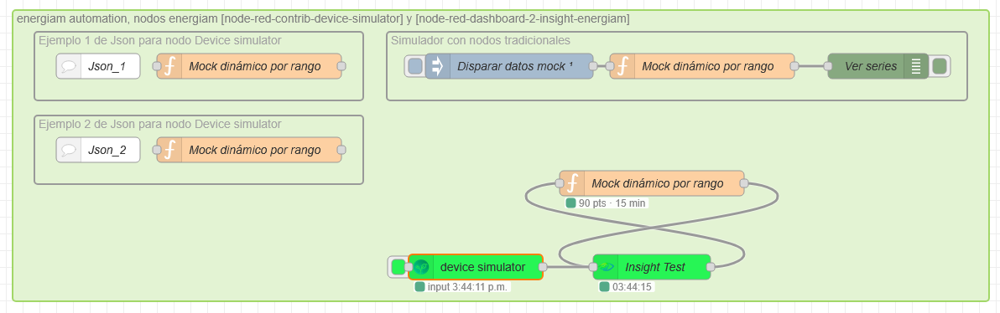

# node-red-dashboard-2-insight-energiam

Widget de visualización de series temporales con **ECharts 5.5.1 offline**, estilo Grafana, para **FlowFuse Dashboard 2.0**. Parte del ecosistema [EnergIAM](https://github.com/energiamEcoTouch).



---

## Características

- Gráfico de líneas multi-serie con múltiples ejes Y
- Time picker con rangos rápidos y rango absoluto personalizado
- Selector de colecciones (series) y métricas (unidades)
- Leyenda interactiva (click para ocultar/mostrar series)
- Stats: min / max / avg por serie
- Panel de opciones: ancho de línea, fill, smooth, offset por serie, colores
- Descarga PNG y CSV
- Estado persistente por instancia (rango, colecciones, opciones)
- **ECharts 5.5.1 bundleado — funciona 100% offline, sin CDN**
- Agnóstico a la fuente de datos (MongoDB, InfluxDB, PostgreSQL, API REST, etc.)

---

## Instalación

```bash
npm install node-red-dashboard-2-insight-energiam
```

O desde **Manage Palette** en Node-RED buscando `insight-energiam`.

---

## Uso rápido

1. Arrastrar el nodo **insight** al canvas
2. Configurar grupo de Dashboard 2.0
3. Conectar la **salida** a una función que consulte la base de datos
4. Devolver el resultado a la **entrada** del nodo con `msg.topic = "insight/data"`

---

## Contrato I/O

### SALIDA — Query Request

El nodo emite automáticamente cuando el usuario interactúa con el widget:

```json
{
  "topic": "insight/query",
  "payload": {
    "desde":       "2024-01-01T00:00:00.000Z",
    "hasta":       "2024-01-01T00:15:00.000Z",
    "colecciones": ["id-coleccion-a", "id-coleccion-b"],
    "horas":       0.25
  }
}
```

| Campo | Descripción |
|---|---|
| `desde` / `hasta` | ISO 8601 UTC |
| `colecciones` | IDs de colecciones activas en el widget |
| `horas` | número si es rango relativo, `null` si es absoluto |

### ENTRADA — Datos del gráfico

```json
{
  "topic": "insight/data",
  "payload": {
    "series":    [ ],
    "colLabels": { "Nombre visible": "id-coleccion" }
  }
}
```

#### Estructura de cada serie

```json
{
  "name":       "Circuito A · kW",
  "metric":     "kW",
  "type":       "line",
  "yAxisIndex": 0,
  "data": [
    [1700000000000, 1.234],
    [1700000060000, 1.456]
  ],
  "smooth":       true,
  "connectNulls": false,
  "lineStyle": { "width": 1, "color": "#58a6ff" },
  "itemStyle": { "color": "#58a6ff" }
}
```

| Campo | Descripción |
|---|---|
| `name` | Nombre en leyenda. Convención: `"NombreSerie · unidad"` |
| `metric` | Unidad del eje Y. Series con igual `metric` comparten eje |
| `yAxisIndex` | 0=izq · 1=der · 2=izq2 · 3=der2 |
| `data` | `[[timestamp_ms, valor], ...]`. `null` es válido para gaps |

#### colLabels

```json
{
  "Circuito A": "z2m-tghc-H404_LP001",
  "Circuito B": "z2m-tghc-H406_LP002",
  "Temperatura": "sensor-temp-01",
  "Red":         "sensor-red-01"
}
```

Las claves son los nombres visibles en el selector del widget. Los valores son los IDs que el nodo usa en el query request. **Cada serie cuyo nombre no empiece con una de estas claves no se mostrará.**

#### Colores sugeridos

```
#58a6ff · #3fb950 · #f78166 · #d2a8ff · #ffa657
#79c0ff · #56d364 · #ff7b72 · #bc8cff · #ffb366
#388bfd · #2ea043 · #da3633 · #8957e5
```

---

## Ejemplo — Adaptador MongoDB

```javascript
// Nodo función conectado a la salida del nodo insight
// Entrada: msg.topic === "insight/query"

const { desde, hasta, colecciones } = msg.payload;

const msgs = colecciones.map((col, i) => ({
    topic: col,
    payload: [
        { time: { $gte: new Date(desde), $lte: new Date(hasta) } },
        { sort: { time: 1 } }
    ],
    parts: {
        id:    Date.now(),
        type:  'array',
        count: colecciones.length,
        index: i
    }
}));

return [msgs];
```

Ver carpeta `examples/` para flujos completos de MongoDB, InfluxDB y PostgreSQL.

---

## Para desarrolladores — Build y publicación

### Prerequisitos

```
node >= 18
npm >= 9
```

### Clonar y preparar

```bash
git clone https://github.com/energiamEcoTouch/node-red-dashboard-2-insight-energiam.git
cd node-red-dashboard-2-insight-energiam
npm install
```

### Build del componente Vue

```bash
npm run build
```

Compila `ui/components/UIInsight.vue` → `resources/ui-insight.umd.js`.
El archivo `.umd.js` **debe incluirse en el commit y en el paquete npm**.

### Estructura del proyecto

```
node-red-dashboard-2-insight-energiam/
├── examples/
│   ├── insight-test-flow.png
│   └── flows_insight_test.json
├── nodes/
│   ├── icons/
│   │   └── energiam.png
│   ├── ui-insight.js
│   └── ui-insight.html
├── ui/
│   ├── components/
│   │   └── UIInsight.vue
│   └── index.js
├── resources/
│   ├── echarts.min.js
│   └── ui-insight.umd.js
├── package.json
├── vite.config.js
└── README.md
```

### Publicar en npm

```bash
npm run build
npm publish
```

---

## Dependencias de runtime

| Dependencia | Versión | Rol |
|---|---|---|
| Node-RED | ≥ 3.0.0 | Runtime |
| @flowfuse/node-red-dashboard | ≥ 1.0.0 | Dashboard 2.0 |
| ECharts | 5.5.1 bundleado | Gráficos offline |

---

## Stack EnergIAM

| Componente | Tecnología |
|---|---|
| Virtualización | Proxmox VE |
| Administración | Komodo |
| IoT | Node-RED + Zigbee2MQTT + MQTT |
| Bases de datos | MongoDB / InfluxDB |
| Visualización | Grafana + Dashboard 2.0 |

---

## Licencia

MIT — EnergIAM EcoTouch 2025
